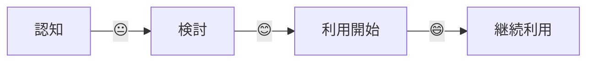

# カスタマージャーニーマップ

## 📌 概要
ユーザー体験の流れを可視化するドキュメントです。

## 🗺️ ジャーニーマップ

### フェーズ 1: 認知・発見

#### タッチポイント

#### ユーザーの行動

#### 感情・思考

#### 課題・ペインポイント

#### 機会・改善点

---

### フェーズ 2: 検討・比較

#### タッチポイント

#### ユーザーの行動

#### 感情・思考

#### 課題・ペインポイント

#### 機会・改善点

---

### フェーズ 3: 利用開始

#### タッチポイント

#### ユーザーの行動

#### 感情・思考

#### 課題・ペインポイント

#### 機会・改善点

---

### フェーズ 4: 継続利用

#### タッチポイント

#### ユーザーの行動

#### 感情・思考

#### 課題・ペインポイント

#### 機会・改善点

## 📊 感情曲線

## 📝 備考

