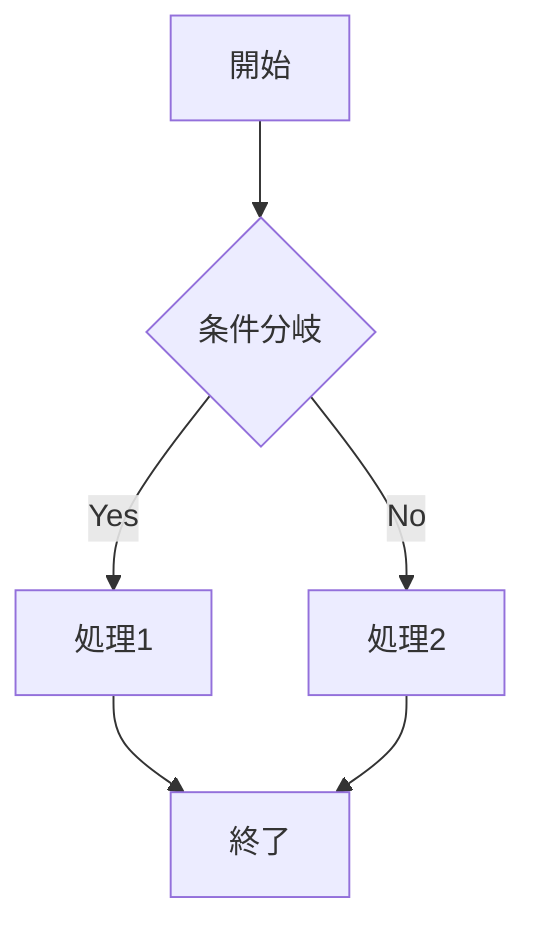
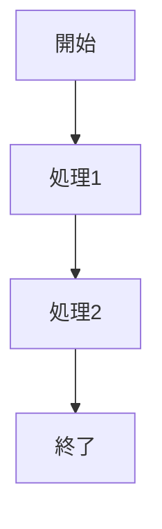

# 業務フロー図

## 📌 概要
業務プロセス全体の流れを可視化するドキュメントです。

## 🔄 主要業務フロー

### フロー 1: [業務名]

#### 処理詳細

| ステップ | 処理内容 | 担当者 | システム |
|---------|---------|--------|---------|
|         |         |        |         |

---

### フロー 2: [業務名]

#### 処理詳細

| ステップ | 処理内容 | 担当者 | システム |
|---------|---------|--------|---------|
|         |         |        |         |

## 🔀 例外処理フロー

### エラーハンドリング

## 📝 備考

