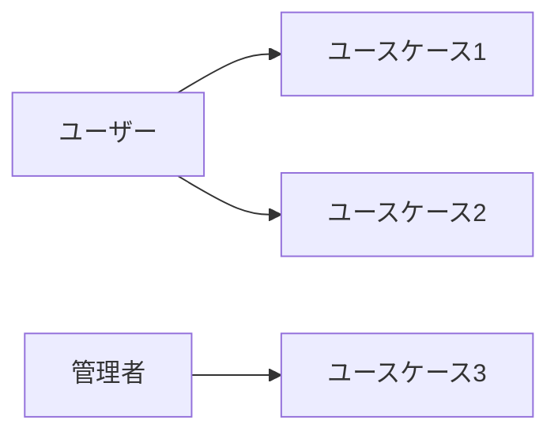

# ユースケース図／シナリオ

## 📌 概要
各ユーザーが何を行うかを定義するドキュメントです。

## 👥 アクター定義

| アクター | 役割 | 説明 |
|---------|------|------|
|         |      |      |

## 📊 ユースケース図

## 📝 ユースケース詳細

### UC-001: [ユースケース名]

#### 基本情報
- **ID**: UC-001
- **名称**: 
- **アクター**: 
- **概要**: 
- **優先度**: 高/中/低

#### 事前条件

#### 事後条件

#### 基本フロー
1. 
2. 
3. 

#### 代替フロー

#### 例外フロー

---

### UC-002: [ユースケース名]

#### 基本情報
- **ID**: UC-002
- **名称**: 
- **アクター**: 
- **概要**: 
- **優先度**: 高/中/低

#### 事前条件

#### 事後条件

#### 基本フロー
1. 
2. 
3. 

#### 代替フロー

#### 例外フロー

## 📝 備考

