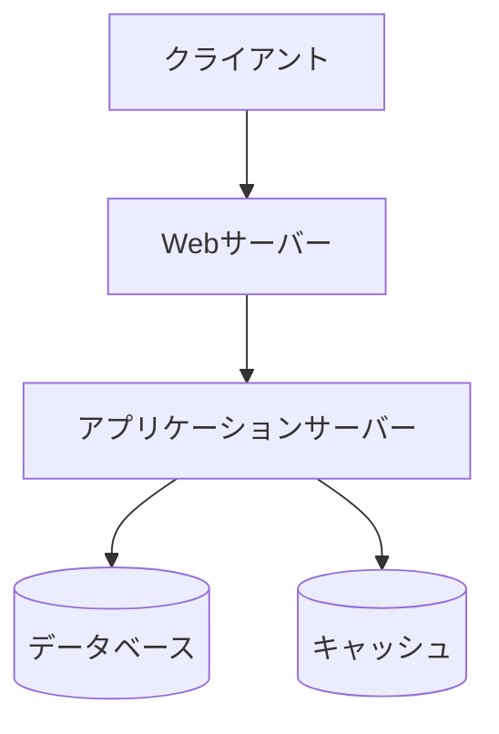
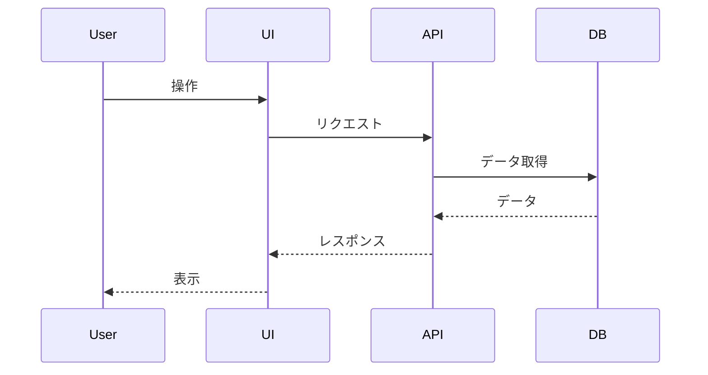

# 基本設計書

## 📌 概要
画面、機能、データ、構成の概要を定義するドキュメントです。

## 🏗️ システム構成

### システム全体構成図

### レイヤー構成

| レイヤー | 技術スタック | 役割 |
|---------|------------|------|
| プレゼンテーション層 |  |  |
| ビジネスロジック層 |  |  |
| データアクセス層 |  |  |

## 🖥️ 画面設計

### 画面一覧

| 画面ID | 画面名 | 概要 | アクセス権限 |
|--------|--------|------|-------------|
|        |        |      |             |

### 画面詳細

#### 画面-001: [画面名]

##### 概要

##### 画面項目

| 項目名 | 入力/表示 | 必須 | 形式 | 初期値 | 備考 |
|--------|----------|------|------|--------|------|
|        |          |      |      |        |      |

##### 操作

| 操作 | 処理内容 | 遷移先 |
|------|---------|--------|
|      |         |        |

## ⚙️ 機能設計

### 機能一覧

| 機能ID | 機能名 | 概要 | 関連画面 |
|--------|--------|------|---------|
|        |        |      |         |

### 機能詳細

#### 機能-001: [機能名]

##### 概要

##### 処理フロー

##### 入力

##### 処理

##### 出力

## 🗄️ データ設計概要

### データストア一覧

| データストア | 種類 | 用途 |
|------------|------|------|
|            |      |      |

## 📝 備考

