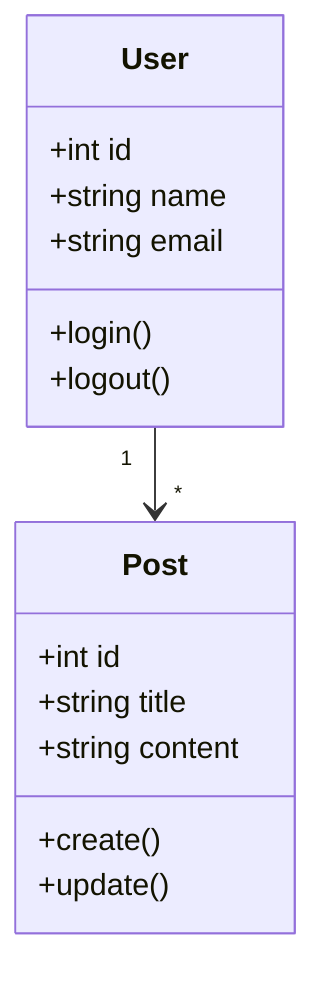
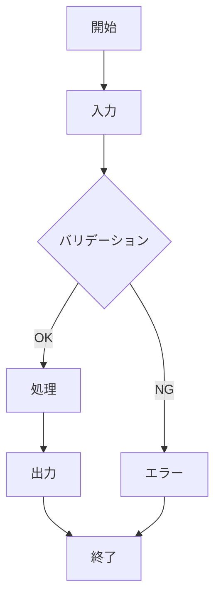

# 詳細設計書

## 📌 概要
クラス、API、テーブル定義など詳細を定義するドキュメントです。

## 🏛️ アーキテクチャ詳細

### ディレクトリ構成

```
src/
├── controllers/
├── services/
├── repositories/
├── models/
├── utils/
└── config/
```

## 📦 クラス設計

### クラス図



### クラス詳細

#### クラス名: [クラス名]

##### 概要

##### 属性

| 属性名 | 型 | 可視性 | 説明 |
|--------|-----|--------|------|
|        |     | public/private/protected |  |

##### メソッド

| メソッド名 | 戻り値 | 引数 | 可視性 | 説明 |
|-----------|--------|------|--------|------|
|           |        |      |        |      |

## 🗄️ テーブル設計

### テーブル定義

#### テーブル名: users

```sql
CREATE TABLE users (
    id BIGINT PRIMARY KEY AUTO_INCREMENT,
    name VARCHAR(255) NOT NULL,
    email VARCHAR(255) UNIQUE NOT NULL,
    password_hash VARCHAR(255) NOT NULL,
    created_at TIMESTAMP DEFAULT CURRENT_TIMESTAMP,
    updated_at TIMESTAMP DEFAULT CURRENT_TIMESTAMP ON UPDATE CURRENT_TIMESTAMP,
    INDEX idx_email (email)
);
```

| カラム名 | データ型 | NULL | デフォルト | 説明 |
|---------|---------|------|-----------|------|
| id | BIGINT | NO | AUTO_INCREMENT | ユーザーID |
| name | VARCHAR(255) | NO | - | ユーザー名 |
| email | VARCHAR(255) | NO | - | メールアドレス |

##### インデックス

| インデックス名 | カラム | ユニーク | 説明 |
|--------------|--------|---------|------|
|              |        | ○/×    |      |

## 🔌 API詳細設計

### エンドポイント一覧

| メソッド | パス | 概要 | 認証 |
|---------|------|------|------|
| GET | /api/users | ユーザー一覧取得 | 必要 |
| POST | /api/users | ユーザー作成 | 必要 |

### API詳細

#### GET /api/users

##### 概要
ユーザー一覧を取得

##### リクエスト
- **Headers**:
  - `Authorization: Bearer {token}`
  
- **Query Parameters**:

| パラメータ | 型 | 必須 | 説明 |
|-----------|-----|------|------|
| page | number | × | ページ番号 |
| limit | number | × | 1ページあたりの件数 |

##### レスポンス

**成功時 (200 OK)**:
```json
{
  "data": [
    {
      "id": 1,
      "name": "John Doe",
      "email": "john@example.com"
    }
  ],
  "pagination": {
    "page": 1,
    "limit": 10,
    "total": 100
  }
}
```

**エラー時 (400/401/500)**:
```json
{
  "error": {
    "code": "ERROR_CODE",
    "message": "エラーメッセージ"
  }
}
```

## 🔄 処理フロー詳細

### 処理-001: [処理名]

#### フローチャート



#### 処理詳細

## 📝 備考

