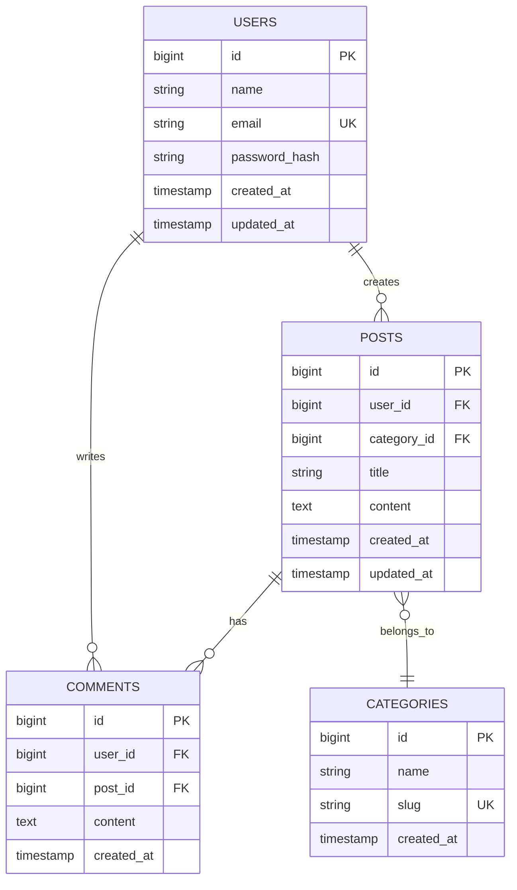

# ER図（データモデル）

## 📌 概要
テーブル間のリレーション定義を可視化するドキュメントです。

## 🗺️ ER図

## 📊 エンティティ詳細

### エンティティ一覧

| エンティティ名 | 物理名 | 概要 | 関連エンティティ |
|--------------|--------|------|-----------------|
| ユーザー | users | システム利用者 | posts, comments |
| 投稿 | posts | ユーザーの投稿 | users, categories, comments |
| コメント | comments | 投稿へのコメント | users, posts |
| カテゴリ | categories | 投稿のカテゴリ | posts |

## 🔗 リレーション詳細

### users - posts (1:N)
- **関係**: 1人のユーザーは複数の投稿を作成できる
- **外部キー**: posts.user_id → users.id
- **削除時**: CASCADE

### posts - comments (1:N)
- **関係**: 1つの投稿に複数のコメントが付けられる
- **外部キー**: comments.post_id → posts.id
- **削除時**: CASCADE

### users - comments (1:N)
- **関係**: 1人のユーザーは複数のコメントを書ける
- **外部キー**: comments.user_id → users.id
- **削除時**: CASCADE

### categories - posts (1:N)
- **関係**: 1つのカテゴリに複数の投稿が属する
- **外部キー**: posts.category_id → categories.id
- **削除時**: RESTRICT

## 🔑 インデックス戦略

### パフォーマンス最適化

| テーブル | カラム | インデックス種類 | 目的 |
|---------|--------|----------------|------|
| users | email | UNIQUE | ログイン高速化 |
| posts | user_id | INDEX | ユーザーの投稿検索 |
| posts | category_id | INDEX | カテゴリ別検索 |
| comments | post_id | INDEX | 投稿のコメント取得 |

## 📈 正規化レベル

### 第3正規形 (3NF)
- 非キー属性の推移的関数従属性を排除
- データの冗長性を最小化

## 📝 備考

