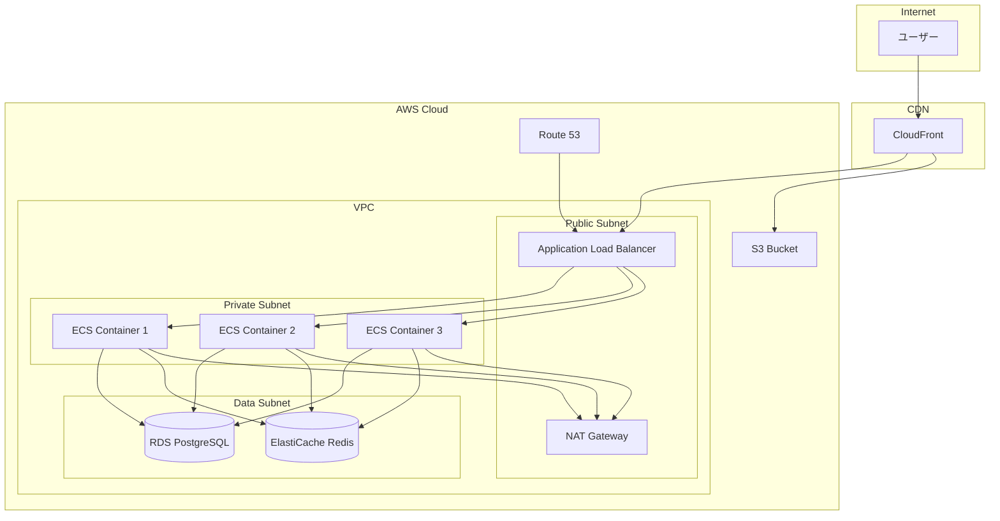

# インフラ設計書

## 📌 概要
ネットワーク構成、AWS／Docker設計などインフラストラクチャを定義するドキュメントです。

## 🏗️ システムアーキテクチャ

### 全体構成図



## ☁️ クラウドインフラ（AWS）

### リージョン・AZ構成

| 環境 | リージョン | AZ | 説明 |
|------|----------|-----|------|
| 本番 | ap-northeast-1 (東京) | 3 AZ | Multi-AZ構成 |
| ステージング | ap-northeast-1 (東京) | 2 AZ | |
| 開発 | ap-northeast-1 (東京) | 1 AZ | |

### VPC設計

#### ネットワーク構成

```
VPC: 10.0.0.0/16

【Public Subnet】
- ap-northeast-1a: 10.0.1.0/24
- ap-northeast-1c: 10.0.2.0/24
- ap-northeast-1d: 10.0.3.0/24

【Private Subnet】
- ap-northeast-1a: 10.0.11.0/24
- ap-northeast-1c: 10.0.12.0/24
- ap-northeast-1d: 10.0.13.0/24

【Data Subnet】
- ap-northeast-1a: 10.0.21.0/24
- ap-northeast-1c: 10.0.22.0/24
- ap-northeast-1d: 10.0.23.0/24
```

#### セキュリティグループ

| 名前 | インバウンド | アウトバウンド | 説明 |
|------|------------|--------------|------|
| alb-sg | 80, 443 from 0.0.0.0/0 | All | ALB用 |
| ecs-sg | 8080 from alb-sg | All | ECS用 |
| rds-sg | 5432 from ecs-sg | - | RDS用 |
| redis-sg | 6379 from ecs-sg | - | Redis用 |

### コンピューティング

#### ECS (Elastic Container Service)

**クラスター構成**:
- **起動タイプ**: Fargate
- **タスク数**: 
  - 本番: 最小3、最大10
  - ステージング: 最小2、最大5
  
**タスク定義**:
```json
{
  "family": "app-task",
  "cpu": "512",
  "memory": "1024",
  "networkMode": "awsvpc",
  "requiresCompatibilities": ["FARGATE"],
  "containerDefinitions": [
    {
      "name": "app",
      "image": "xxx.dkr.ecr.ap-northeast-1.amazonaws.com/app:latest",
      "portMappings": [
        {
          "containerPort": 8080,
          "protocol": "tcp"
        }
      ],
      "environment": [],
      "secrets": [],
      "logConfiguration": {
        "logDriver": "awslogs",
        "options": {
          "awslogs-group": "/ecs/app",
          "awslogs-region": "ap-northeast-1",
          "awslogs-stream-prefix": "ecs"
        }
      }
    }
  ]
}
```

**オートスケーリング**:
- **メトリクス**: CPU使用率
- **スケールアウト**: CPU > 70%
- **スケールイン**: CPU < 30%

#### Application Load Balancer

**リスナー**:
- HTTP (80) → HTTPS (443) リダイレクト
- HTTPS (443) → ターゲットグループ

**ターゲットグループ**:
- **プロトコル**: HTTP
- **ポート**: 8080
- **ヘルスチェック**: `/health`
- **ヘルスチェック間隔**: 30秒

### データストア

#### RDS (PostgreSQL)

| 項目 | 本番 | ステージング |
|------|------|------------|
| エンジン | PostgreSQL 15 | PostgreSQL 15 |
| インスタンスクラス | db.t3.medium | db.t3.small |
| ストレージ | 100GB (gp3) | 50GB (gp3) |
| Multi-AZ | 有効 | 無効 |
| 自動バックアップ | 7日間 | 3日間 |
| 暗号化 | 有効 | 有効 |

**パラメータグループ**:
```
max_connections = 200
shared_buffers = 256MB
work_mem = 16MB
maintenance_work_mem = 128MB
```

#### ElastiCache (Redis)

| 項目 | 本番 | ステージング |
|------|------|------------|
| エンジン | Redis 7.0 | Redis 7.0 |
| ノードタイプ | cache.t3.medium | cache.t3.small |
| レプリケーション | 2レプリカ | 1レプリカ |
| 自動フェイルオーバー | 有効 | 無効 |

### ストレージ

#### S3バケット

| バケット名 | 用途 | バージョニング | ライフサイクル |
|-----------|------|--------------|--------------|
| app-static-prod | 静的ファイル | 無効 | - |
| app-uploads-prod | アップロードファイル | 有効 | 90日後Glacier |
| app-logs-prod | ログ保存 | 無効 | 30日後削除 |
| app-backup-prod | バックアップ | 有効 | 365日後削除 |

### CDN

#### CloudFront

**オリジン**:
- ALB: 動的コンテンツ
- S3: 静的コンテンツ

**キャッシュ動作**:
```
/api/*     : キャッシュなし
/static/*  : キャッシュ 1日
/images/*  : キャッシュ 7日
```

**セキュリティ**:
- SSL/TLS証明書: ACM
- WAF: 有効
- Origin Access Identity: S3用

## 🐳 Docker構成

### Dockerfile

```dockerfile
# マルチステージビルド
FROM node:18-alpine AS builder

WORKDIR /app
COPY package*.json ./
RUN npm ci --only=production

COPY . .
RUN npm run build

# 本番イメージ
FROM node:18-alpine

WORKDIR /app

# 非rootユーザーで実行
RUN addgroup -g 1001 -S nodejs && \
    adduser -S nodejs -u 1001

COPY --from=builder --chown=nodejs:nodejs /app/dist ./dist
COPY --from=builder --chown=nodejs:nodejs /app/node_modules ./node_modules
COPY --chown=nodejs:nodejs package*.json ./

USER nodejs

EXPOSE 8080

HEALTHCHECK --interval=30s --timeout=3s \
  CMD node healthcheck.js

CMD ["node", "dist/main.js"]
```

### docker-compose.yml（ローカル開発用）

```yaml
version: '3.8'

services:
  app:
    build: .
    ports:
      - "8080:8080"
    environment:
      - NODE_ENV=development
      - DATABASE_URL=postgresql://postgres:password@db:5432/app_dev
      - REDIS_URL=redis://redis:6379
    depends_on:
      - db
      - redis
    volumes:
      - ./src:/app/src
    command: npm run dev

  db:
    image: postgres:15-alpine
    environment:
      - POSTGRES_USER=postgres
      - POSTGRES_PASSWORD=password
      - POSTGRES_DB=app_dev
    ports:
      - "5432:5432"
    volumes:
      - postgres_data:/var/lib/postgresql/data

  redis:
    image: redis:7-alpine
    ports:
      - "6379:6379"
    volumes:
      - redis_data:/data

  nginx:
    image: nginx:alpine
    ports:
      - "80:80"
    volumes:
      - ./nginx.conf:/etc/nginx/nginx.conf:ro
    depends_on:
      - app

volumes:
  postgres_data:
  redis_data:
```

## 🔄 CI/CD パイプライン

### GitHub Actions

```yaml
name: Deploy to Production

on:
  push:
    branches: [main]

jobs:
  build:
    runs-on: ubuntu-latest
    steps:
      - uses: actions/checkout@v3
      
      - name: Configure AWS credentials
        uses: aws-actions/configure-aws-credentials@v2
        with:
          aws-access-key-id: ${{ secrets.AWS_ACCESS_KEY_ID }}
          aws-secret-access-key: ${{ secrets.AWS_SECRET_ACCESS_KEY }}
          aws-region: ap-northeast-1
      
      - name: Login to Amazon ECR
        id: login-ecr
        uses: aws-actions/amazon-ecr-login@v1
      
      - name: Build and push image
        env:
          ECR_REGISTRY: ${{ steps.login-ecr.outputs.registry }}
          ECR_REPOSITORY: app
          IMAGE_TAG: ${{ github.sha }}
        run: |
          docker build -t $ECR_REGISTRY/$ECR_REPOSITORY:$IMAGE_TAG .
          docker push $ECR_REGISTRY/$ECR_REPOSITORY:$IMAGE_TAG
      
      - name: Deploy to ECS
        run: |
          aws ecs update-service \
            --cluster app-cluster \
            --service app-service \
            --force-new-deployment
```

## 📊 監視・ロギング

### CloudWatch

**メトリクス監視**:
- CPU使用率
- メモリ使用率
- ディスク使用率
- ネットワークトラフィック
- RDS接続数
- ALBリクエスト数

**アラーム設定**:

| メトリクス | 閾値 | アクション |
|-----------|------|----------|
| CPU使用率 | > 80% | SNS通知 |
| メモリ使用率 | > 85% | SNS通知 |
| RDS接続数 | > 180 | SNS通知 |
| 5xx エラー率 | > 5% | SNS通知 |

### ログ管理

**CloudWatch Logs**:
- アプリケーションログ: `/ecs/app`
- ALBアクセスログ: `/aws/alb`
- RDSログ: `/aws/rds`

**ログ保持期間**:
- アプリケーションログ: 30日
- アクセスログ: 90日
- エラーログ: 180日

## 💰 コスト最適化

### リザーブドインスタンス
- RDS: 1年間リザーブド
- ElastiCache: 1年間リザーブド

### スケジュールスケーリング
- ステージング環境: 平日9-18時のみ稼働
- 開発環境: 必要時のみ起動

### ストレージ最適化
- S3ライフサイクルポリシー
- EBS スナップショット自動削除

## 📝 備考

