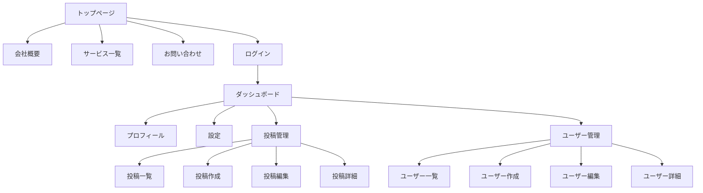
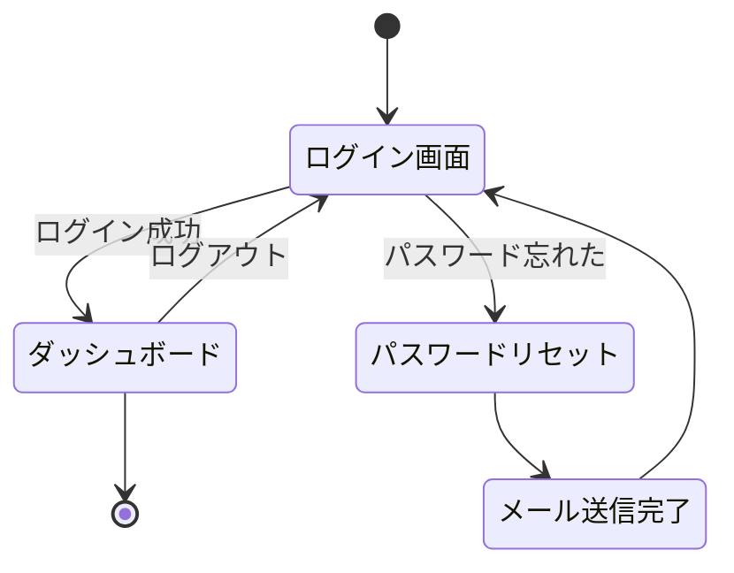
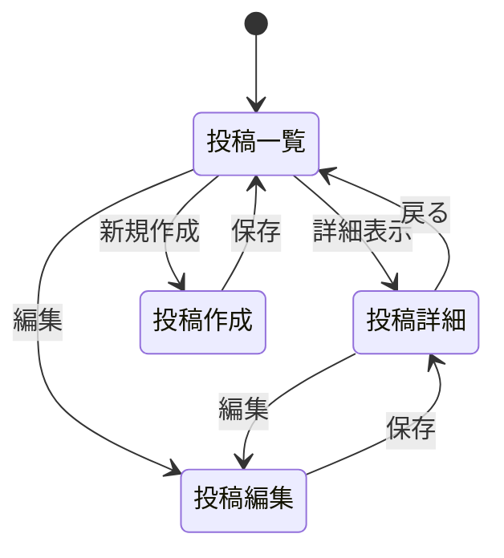

# 画面遷移図／サイトマップ

## 📌 概要
画面の関係性と遷移ルートを定義するドキュメントです。

## 🗺️ サイトマップ

## 🔀 画面遷移図

### 認証フロー

### 投稿管理フロー

## 📋 画面一覧

### パブリックページ

| 画面ID | 画面名 | パス | 認証 | 説明 |
|--------|--------|------|------|------|
| PUB-001 | トップページ | `/` | 不要 | サイトのトップページ |
| PUB-002 | 会社概要 | `/about` | 不要 | 会社情報 |
| PUB-003 | サービス一覧 | `/services` | 不要 | 提供サービス |
| PUB-004 | お問い合わせ | `/contact` | 不要 | お問い合わせフォーム |
| PUB-005 | ログイン | `/login` | 不要 | ログイン画面 |
| PUB-006 | 会員登録 | `/register` | 不要 | 新規登録画面 |

### 管理画面

| 画面ID | 画面名 | パス | 権限 | 説明 |
|--------|--------|------|------|------|
| ADM-001 | ダッシュボード | `/dashboard` | ユーザー | メインダッシュボード |
| ADM-002 | プロフィール | `/profile` | ユーザー | プロフィール表示・編集 |
| ADM-003 | 設定 | `/settings` | ユーザー | 各種設定 |
| ADM-101 | 投稿一覧 | `/posts` | ユーザー | 投稿の一覧表示 |
| ADM-102 | 投稿詳細 | `/posts/:id` | ユーザー | 投稿の詳細表示 |
| ADM-103 | 投稿作成 | `/posts/new` | ユーザー | 新規投稿作成 |
| ADM-104 | 投稿編集 | `/posts/:id/edit` | ユーザー | 投稿編集 |
| ADM-201 | ユーザー一覧 | `/admin/users` | 管理者 | ユーザー管理 |
| ADM-202 | ユーザー詳細 | `/admin/users/:id` | 管理者 | ユーザー詳細 |

## 🔐 権限別アクセス制御

### ゲストユーザー
- パブリックページのみアクセス可能
- ログイン・会員登録ページへアクセス可能

### 一般ユーザー
- ゲストユーザーの権限 +
- ダッシュボード、プロフィール、設定
- 投稿の作成・編集・削除（自分の投稿のみ）

### 管理者
- 一般ユーザーの権限 +
- 全ユーザーの管理
- 全投稿の管理
- システム設定

## 🔄 遷移パターン

### パターン1: 通常遷移
- ユーザーの操作による画面遷移
- ボタンクリック、リンククリックなど

### パターン2: リダイレクト
- 認証が必要な画面への未認証アクセス → ログイン画面
- ログイン成功 → 元のページまたはダッシュボード

### パターン3: モーダル
- 確認ダイアログ
- 詳細情報の表示
- フォーム入力

### パターン4: タブ切り替え
- 同一画面内でのコンテンツ切り替え
- ページ遷移なし

## 📊 遷移マトリクス

| From / To | トップ | ログイン | ダッシュボード | 投稿一覧 | 設定 |
|-----------|--------|---------|--------------|---------|------|
| トップ | - | ○ | × | × | × |
| ログイン | ○ | - | ○ | × | × |
| ダッシュボード | ○ | × | - | ○ | ○ |
| 投稿一覧 | × | × | ○ | - | × |
| 設定 | × | × | ○ | × | - |

○: 直接遷移可能  
×: 直接遷移不可  
-: 同一画面

## 📝 備考

