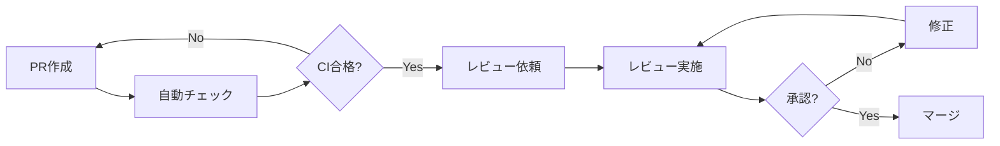

# レビュー記録／コードレビュー表

## 📌 概要
コード品質と修正記録を管理するドキュメントです。

## 🎯 コードレビューの目的

1. **品質向上**: バグの早期発見と修正
2. **知識共有**: チーム全体の技術力向上
3. **標準化**: コーディング規約の遵守
4. **セキュリティ**: 脆弱性の早期発見

## 📋 レビュープロセス

### フロー



### レビュー基準

| 項目 | チェックポイント |
|------|----------------|
| **機能性** | 要件を満たしているか |
| **コード品質** | 可読性、保守性、再利用性 |
| **テスト** | 十分なテストカバレッジ |
| **セキュリティ** | 脆弱性がないか |
| **パフォーマンス** | 効率的な実装か |
| **ドキュメント** | 適切なコメントとドキュメント |

## 📝 レビュー記録

### PR#123: ユーザー認証機能の実装

| 項目 | 内容 |
|------|------|
| **PR番号** | #123 |
| **タイトル** | feat: ユーザー認証機能の実装 |
| **作成者** | 田中太郎 |
| **レビュアー** | 山田花子、佐藤次郎 |
| **作成日** | 2025-11-01 |
| **レビュー日** | 2025-11-02 |
| **マージ日** | 2025-11-03 |
| **ステータス** | Merged |
| **変更行数** | +450, -120 |

**概要**:
JWTを使用したユーザー認証機能を実装。ログイン、ログアウト、トークンリフレッシュをサポート。

**変更ファイル**:
- `src/auth/auth.controller.ts` (新規)
- `src/auth/auth.service.ts` (新規)
- `src/auth/jwt.strategy.ts` (新規)
- `src/users/users.service.ts` (修正)

**レビューコメント**:

#### 山田花子 - 2025-11-02 10:30

**指摘事項**:
```typescript
// auth.service.ts:45
async login(email: string, password: string) {
  const user = await this.usersService.findByEmail(email);
  if (!user || !await bcrypt.compare(password, user.password)) {
    throw new UnauthorizedException('Invalid credentials');
  }
  // ...
}
```

**コメント**:
タイミング攻撃を防ぐため、ユーザーが存在しない場合も同じ処理時間がかかるようにすべきです。

**推奨修正**:
```typescript
async login(email: string, password: string) {
  const user = await this.usersService.findByEmail(email);
  const dummyHash = '$2b$10$dummyhashvalue...';
  const passwordToCompare = user?.password || dummyHash;
  
  const isValid = await bcrypt.compare(password, passwordToCompare);
  
  if (!user || !isValid) {
    throw new UnauthorizedException('Invalid credentials');
  }
  // ...
}
```

**ステータス**: ✅ 修正済み  
**コミット**: abc123

---

#### 佐藤次郎 - 2025-11-02 14:15

**指摘事項**:
```typescript
// jwt.strategy.ts:20
async validate(payload: any) {
  return { userId: payload.sub, email: payload.email };
}
```

**コメント**:
`any` 型の使用を避けるべきです。型を明示してください。

**推奨修正**:
```typescript
interface JwtPayload {
  sub: number;
  email: string;
  iat: number;
  exp: number;
}

async validate(payload: JwtPayload) {
  return { userId: payload.sub, email: payload.email };
}
```

**ステータス**: ✅ 修正済み  
**コミット**: def456

---

#### 山田花子 - 2025-11-02 16:00

**Good Point**: ✨
```typescript
// auth.service.ts:78
private generateTokens(user: User) {
  const payload = { sub: user.id, email: user.email };
  return {
    access_token: this.jwtService.sign(payload, { expiresIn: '15m' }),
    refresh_token: this.jwtService.sign(payload, { expiresIn: '7d' }),
  };
}
```

**コメント**:
アクセストークンとリフレッシュトークンで有効期限を分けているのは良い設計です！

---

**総評**:
セキュリティ面での懸念事項は修正済み。テストも十分にカバーされており、マージ可能です。

**レビュー結果**: ✅ Approved

---

### PR#125: Safari コメント投稿バグ修正

| 項目 | 内容 |
|------|------|
| **PR番号** | #125 |
| **タイトル** | fix: Safari でコメントが投稿できない問題を修正 |
| **作成者** | 田中次郎 |
| **レビュアー** | 鈴木一郎 |
| **作成日** | 2025-11-08 |
| **レビュー日** | 2025-11-09 |
| **ステータス** | Changes Requested |
| **関連Issue** | BUG-101 |
| **変更行数** | +15, -5 |

**概要**:
Safari で `FormData.get()` が `null` を返す場合の処理を追加。

**変更ファイル**:
- `src/components/CommentForm.tsx`

**レビューコメント**:

#### 鈴木一郎 - 2025-11-09 09:00

**指摘事項**:
```typescript
// CommentForm.tsx:45
const content = formData.get('content');
if (!content) {
  throw new Error('コメント内容は必須です');
}
const trimmedContent = content.toString().trim();
```

**コメント**:
エラーハンドリングは良いですが、ユーザーへのフィードバックがありません。エラーメッセージをUI に表示すべきです。

**推奨修正**:
```typescript
const content = formData.get('content');
if (!content) {
  setError('コメント内容は必須です');
  return;
}
const trimmedContent = content.toString().trim();
if (trimmedContent.length === 0) {
  setError('コメント内容を入力してください');
  return;
}
```

**ステータス**: ⏳ 対応待ち

---

#### 鈴木一郎 - 2025-11-09 09:15

**コメント**:
テストケースも追加してください。

**推奨追加**:
```typescript
describe('CommentForm', () => {
  it('should show error when content is null', () => {
    // テストコード
  });
  
  it('should show error when content is empty string', () => {
    // テストコード
  });
});
```

**ステータス**: ⏳ 対応待ち

---

**レビュー結果**: ❌ Changes Requested

---

### PR#127: バッチ処理のメモリ最適化

| 項目 | 内容 |
|------|------|
| **PR番号** | #127 |
| **タイトル** | perf: バッチ処理をストリーム処理に変更 |
| **作成者** | 鈴木三郎 |
| **レビュアー** | 山田花子、田中太郎 |
| **作成日** | 2025-11-07 |
| **レビュー日** | 2025-11-08 |
| **ステータス** | In Review |
| **関連Issue** | BUG-103 |
| **変更行数** | +85, -45 |

**概要**:
大量データ処理時のメモリ不足を解消するため、バッチ処理をストリーム処理に変更。

**変更ファイル**:
- `src/batch/data-processor.service.ts`
- `src/batch/stream-processor.service.ts` (新規)

**レビューコメント**:

#### 山田花子 - 2025-11-08 10:00

**質問**: ❓
メモリ使用量の改善をどのように測定しましたか？before/after のデータがあれば確認したいです。

**回答待ち**: ⏳

---

#### 田中太郎 - 2025-11-08 11:30

**指摘事項**:
```typescript
// stream-processor.service.ts:35
if (global.gc) {
  global.gc();
}
```

**コメント**:
明示的な GC 呼び出しは通常推奨されません。本当に必要ですか？
代わりに、適切なメモリ管理（参照の解放など）で対応できないでしょうか？

**ステータス**: 💬 議論中

---

**レビュー結果**: 💬 In Discussion

---

## 📊 レビュー統計

### 期間別レビュー数（2025年11月）

| 期間 | PR数 | 承認 | 修正要求 | マージ済み |
|------|------|------|---------|----------|
| Week 1 | 12 | 10 | 2 | 10 |
| Week 2 | 15 | 12 | 3 | 11 |
| Week 3 | 8 | 6 | 2 | 5 |

### レビュアー別

| レビュアー | レビュー数 | 平均レビュー時間 |
|-----------|----------|----------------|
| 山田花子 | 18 | 2.3時間 |
| 佐藤次郎 | 15 | 1.8時間 |
| 鈴木一郎 | 12 | 3.1時間 |
| 田中太郎 | 10 | 2.5時間 |

### 指摘カテゴリ

| カテゴリ | 件数 | 割合 |
|---------|------|------|
| コード品質 | 25 | 35% |
| セキュリティ | 15 | 21% |
| パフォーマンス | 12 | 17% |
| テスト | 10 | 14% |
| ドキュメント | 8 | 11% |
| その他 | 2 | 3% |

## ✅ レビューチェックリスト

### 機能性
- [ ] 要件を満たしているか
- [ ] エッジケースが考慮されているか
- [ ] エラーハンドリングが適切か

### コード品質
- [ ] コーディング規約に準拠しているか
- [ ] 命名が適切か
- [ ] コードが読みやすいか
- [ ] 重複コードがないか
- [ ] 適切に関数・クラスが分割されているか

### テスト
- [ ] ユニットテストが書かれているか
- [ ] テストカバレッジが十分か
- [ ] エッジケースのテストがあるか
- [ ] テストが pass するか

### セキュリティ
- [ ] 入力値のバリデーションがあるか
- [ ] 機密情報がハードコードされていないか
- [ ] 適切な認証・認可チェックがあるか
- [ ] SQLインジェクション対策があるか
- [ ] XSS対策があるか

### パフォーマンス
- [ ] 不要なループがないか
- [ ] N+1問題がないか
- [ ] 適切にキャッシュを使用しているか
- [ ] メモリリークの可能性がないか

### ドキュメント
- [ ] コメントが適切に書かれているか
- [ ] 複雑なロジックに説明があるか
- [ ] APIドキュメントが更新されているか

## 💡 レビューのベストプラクティス

### レビュアーとして
1. **建設的に**: 批判ではなく、改善提案を
2. **具体的に**: 「良くない」ではなく、「〇〇にすべき」
3. **迅速に**: 24時間以内にレビュー
4. **質問する**: 理解できない部分は質問
5. **Good Point も伝える**: 良いコードは褒める

### レビュイーとして
1. **小さなPR**: 変更は小さく、頻繁に
2. **説明を丁寧に**: PR の概要と背景を明記
3. **自己レビュー**: 提出前に自分でレビュー
4. **防御的にならない**: フィードバックを前向きに受け止める
5. **感謝する**: レビューに時間を割いてくれたことに感謝

## 📝 備考

### レビューツール
- GitHub Pull Requests
- CodeClimate
- SonarQube

### 自動チェック
- ESLint
- Prettier
- TypeScript compiler
- Unit Tests (Jest)
- E2E Tests (Playwright)

