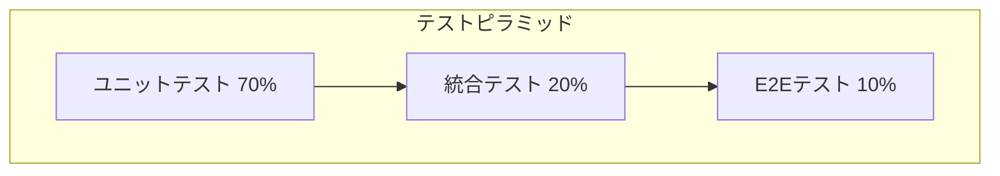
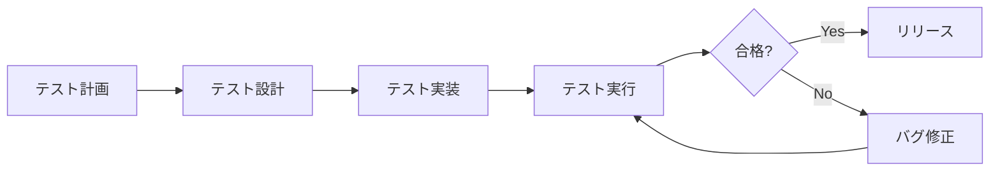

# テスト計画書

## 📌 概要
テスト方針・範囲・体制を定義するドキュメントです。

## 🎯 テスト目的

本プロジェクトのテスト活動は以下を目的とします:

1. **品質保証**: システムが要件を満たしていることを確認
2. **バグの早期発見**: 開発段階でのバグ検出とコスト削減
3. **回帰防止**: 既存機能への影響がないことを保証
4. **ドキュメント化**: テストコードによる仕様の明文化

## 📋 テスト戦略

### テストピラミッド



### テストレベル

| テストレベル | 目的 | 実行タイミング | 担当 |
|------------|------|--------------|------|
| ユニットテスト | 個別関数・クラスの動作確認 | コミット時 | 開発者 |
| 統合テスト | モジュール間の連携確認 | プルリクエスト時 | 開発者 |
| E2Eテスト | システム全体の動作確認 | デプロイ前 | QA |
| 性能テスト | パフォーマンス検証 | リリース前 | QA |
| セキュリティテスト | 脆弱性診断 | リリース前 | セキュリティチーム |

## 🧪 テスト種別

### 機能テスト

#### ユニットテスト
- **対象**: 関数、メソッド、クラス
- **ツール**: Jest, Vitest
- **カバレッジ目標**: 80%以上
- **実行頻度**: 毎コミット

#### 統合テスト
- **対象**: API、データベース連携
- **ツール**: Jest, Supertest
- **カバレッジ目標**: 主要フロー100%
- **実行頻度**: プルリクエスト時

#### E2Eテスト
- **対象**: ユーザーシナリオ全体
- **ツール**: Playwright, Cypress
- **カバレッジ目標**: クリティカルパス100%
- **実行頻度**: デプロイ前

### 非機能テスト

#### 性能テスト
- **負荷テスト**: 想定負荷での性能確認
- **ストレステスト**: 限界値の確認
- **ツール**: k6, Apache JMeter

#### セキュリティテスト
- **脆弱性スキャン**: OWASP ZAP
- **依存関係チェック**: Snyk, npm audit
- **ペネトレーションテスト**: 外部業者委託

#### 互換性テスト
- **ブラウザ**: Chrome, Firefox, Safari, Edge
- **デバイス**: PC, タブレット, スマートフォン
- **OS**: Windows, macOS, iOS, Android

## 📊 テスト範囲

### インスコープ

| 機能 | ユニット | 統合 | E2E | 優先度 |
|------|---------|------|-----|--------|
| ユーザー認証 | ○ | ○ | ○ | 高 |
| 投稿CRUD | ○ | ○ | ○ | 高 |
| コメント機能 | ○ | ○ | ○ | 中 |
| 検索機能 | ○ | ○ | ○ | 中 |
| 管理画面 | ○ | ○ | △ | 中 |
| 通知機能 | ○ | ○ | × | 低 |

○: 必須  
△: 一部実施  
×: 対象外

### アウトスコープ

- サードパーティAPIの内部動作
- 外部サービスの可用性
- ブラウザのバグ

## 👥 テスト体制

### 役割と責任

| 役割 | 担当者 | 責任範囲 |
|------|--------|---------|
| テストリーダー | 山田 | テスト計画・レビュー |
| 開発者 | 各開発メンバー | ユニット・統合テスト |
| QAエンジニア | 佐藤、鈴木 | E2E・性能テスト |
| セキュリティ担当 | 田中 | セキュリティテスト |

## 📅 テストスケジュール

### マイルストーン

| フェーズ | 期間 | テスト内容 |
|---------|------|----------|
| 設計レビュー | Week 1-2 | テスト設計書レビュー |
| ユニットテスト | Week 3-6 | 開発と並行して実施 |
| 統合テスト | Week 7-8 | API・DB連携テスト |
| E2Eテスト | Week 9-10 | シナリオテスト |
| 性能テスト | Week 11 | 負荷テスト |
| 最終テスト | Week 12 | リグレッションテスト |

## 🛠️ テスト環境

### 環境構成

| 環境 | 用途 | データ | URL |
|------|------|--------|-----|
| ローカル | 開発者テスト | モックデータ | localhost |
| CI | 自動テスト | テストデータ | - |
| ステージング | 統合・E2Eテスト | 本番相当データ | https://staging.example.com |
| 本番 | - | 本番データ | https://example.com |

### テストデータ

#### データ準備方針
- **ローカル**: Docker Composeで自動生成
- **CI**: シードデータを使用
- **ステージング**: 本番データの匿名化版

#### データリセット
- 各テスト実行前にデータベースをリセット
- テスト間の依存関係を排除

## 📈 品質基準

### 合格基準

| 指標 | 目標値 | 測定方法 |
|------|--------|---------|
| ユニットテストカバレッジ | 80%以上 | Jest Coverage |
| 統合テストカバレッジ | 主要フロー100% | 手動確認 |
| E2Eテスト成功率 | 100% | CI結果 |
| クリティカルバグ | 0件 | バグ管理システム |
| 重大バグ | 2件以下 | バグ管理システム |
| 応答時間 | 2秒以内 | 性能テスト結果 |

### バグの優先度定義

| レベル | 説明 | 例 |
|--------|------|-----|
| Critical | システムが使用不可 | サーバークラッシュ |
| High | 主要機能が動作しない | ログインできない |
| Medium | 一部機能に支障 | 検索結果が不正確 |
| Low | 軽微な問題 | 表示崩れ |

## 🔄 テストプロセス

### ワークフロー



### 自動化戦略

#### CI/CDパイプライン

```yaml
# GitHub Actions 例
name: Test Pipeline

on: [push, pull_request]

jobs:
  test:
    runs-on: ubuntu-latest
    steps:
      - uses: actions/checkout@v3
      
      - name: Setup Node.js
        uses: actions/setup-node@v3
        with:
          node-version: '18'
      
      - name: Install dependencies
        run: npm ci
      
      - name: Run linter
        run: npm run lint
      
      - name: Run unit tests
        run: npm test -- --coverage
      
      - name: Run integration tests
        run: npm run test:integration
      
      - name: Run E2E tests
        run: npm run test:e2e
      
      - name: Upload coverage
        uses: codecov/codecov-action@v3
```

## 📊 レポーティング

### テスト結果報告

- **頻度**: 毎日（デイリースタンドアップ）
- **形式**: テストサマリーレポート
- **配布先**: 開発チーム、プロジェクトマネージャー

### メトリクス

- テスト実行数
- 成功率
- カバレッジ率
- バグ検出数
- バグ修正率

## 🚀 リリース判定基準

### Go/No-Go チェックリスト

- [ ] 全ユニットテストが合格
- [ ] 統合テストが合格
- [ ] E2Eテストが合格
- [ ] クリティカルバグが0件
- [ ] 性能基準を満たしている
- [ ] セキュリティスキャンが合格
- [ ] ステークホルダーの承認取得

## 📝 備考

### 継続的改善
- テスト結果を分析し、テスト戦略を改善
- 新しいバグパターンに対するテストケース追加
- テスト自動化率の向上

