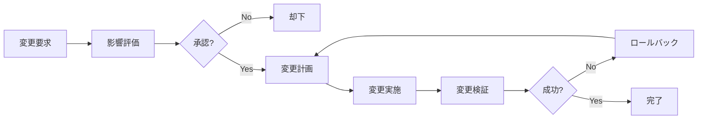

# 変更管理台帳

## 📌 概要
バージョン管理・変更履歴の一覧を管理するドキュメントです。

## 📋 変更管理プロセス

### 変更フロー



### 変更分類

| 分類 | 説明 | 承認者 | 実施タイミング |
|------|------|--------|--------------|
| **標準変更** | 定型的・低リスクな変更 | チームリーダー | 随時 |
| **通常変更** | 計画的な変更 | プロジェクトマネージャー | 事前計画 |
| **緊急変更** | 障害対応など緊急性の高い変更 | 運用責任者 | 即時 |

## 📊 変更記録一覧

### CHG-001: 本番環境へのv1.0.0デプロイ

| 項目 | 内容 |
|------|------|
| **変更ID** | CHG-001 |
| **変更タイトル** | 本番環境へのv1.0.0デプロイ |
| **分類** | 通常変更 |
| **優先度** | 高 |
| **要求者** | プロダクトマネージャー |
| **実施者** | インフラチーム |
| **承認者** | CTO |
| **要求日** | 2025-11-01 |
| **計画日** | 2025-11-15 20:00 |
| **実施日** | 2025-11-15 20:15 |
| **完了日** | 2025-11-15 21:30 |
| **ステータス** | 完了 |
| **リスクレベル** | 中 |

#### 変更内容
初回本番リリース。v1.0.0を本番環境にデプロイ。

#### 変更理由
プロダクトのGA（一般提供開始）

#### 影響範囲
- 本番環境の全サービス
- 全ユーザー

#### 変更手順
1. メンテナンス告知（1週間前）
2. データベースバックアップ作成
3. マイグレーション実行
4. アプリケーションデプロイ
5. ヘルスチェック確認
6. 段階的トラフィック切り替え
7. 監視強化

#### ロールバック計画
- 15分以内に問題が検出された場合、前バージョンにロールバック
- データベースマイグレーションのロールバックスクリプト準備済み

#### 検証項目
- [x] ヘルスチェック正常
- [x] ログインテスト成功
- [x] 主要機能の動作確認
- [x] パフォーマンス監視
- [x] エラー率確認

#### 結果
成功。全ての検証項目をクリア。予定通り21:30に完了。

---

### CHG-002: データベース接続プールサイズ変更（緊急）

| 項目 | 内容 |
|------|------|
| **変更ID** | CHG-002 |
| **変更タイトル** | データベース接続プールサイズ緊急拡大 |
| **分類** | 緊急変更 |
| **優先度** | Critical |
| **要求者** | 運用チーム |
| **実施者** | 鈴木一郎 |
| **承認者** | 運用責任者（口頭承認） |
| **計画日** | 2025-11-09 14:50 |
| **実施日** | 2025-11-09 14:55 |
| **完了日** | 2025-11-09 15:00 |
| **ステータス** | 完了 |
| **関連インシデント** | INC-001 |

#### 変更内容
接続プールサイズを20から50に増加。

#### 変更理由
INC-001: 接続プール枯渇によるサービス停止への緊急対応。

#### 変更手順
```bash
# 環境変数更新
DATABASE_MAX_CONNECTIONS=50

# ECSサービス更新
aws ecs update-service --force-new-deployment
```

#### 結果
成功。サービス復旧を確認。

---

### CHG-003: RDSインスタンスタイプ変更

| 項目 | 内容 |
|------|------|
| **変更ID** | CHG-003 |
| **変更タイトル** | RDSインスタンスをdb.t3.medium→db.t3.largeにスケールアップ |
| **分類** | 通常変更 |
| **優先度** | 中 |
| **要求者** | インフラチーム |
| **実施者** | 田中次郎 |
| **承認者** | インフラマネージャー |
| **計画日** | 2025-11-20 02:00 |
| **実施日** | - |
| **ステータス** | 計画中 |

#### 変更内容
パフォーマンス改善のため、RDSインスタンスタイプをアップグレード。

#### 変更理由
- CPU使用率が常に70%以上
- ピーク時に80%超えることがある
- レスポンスタイムの改善が必要

#### ダウンタイム
約5〜10分のダウンタイムが発生する見込み。

#### 変更手順
```bash
# 1. メンテナンスウィンドウ設定
# 2. RDSインスタンス変更
aws rds modify-db-instance \
  --db-instance-identifier prod-db \
  --db-instance-class db.t3.large \
  --apply-immediately

# 3. 再起動完了まで監視
# 4. 接続確認
# 5. パフォーマンス検証
```

#### コスト影響
月額コスト: $50 → $100（約2倍）

---

## 📅 変更スケジュール

### 2025年11月

| 日付 | 変更ID | タイトル | 分類 | 実施時間 | ステータス |
|------|--------|---------|------|---------|----------|
| 11/15 | CHG-001 | v1.0.0デプロイ | 通常 | 20:00-22:00 | 完了 |
| 11/20 | CHG-003 | RDSスケールアップ | 通常 | 02:00-02:30 | 計画中 |
| 11/25 | CHG-004 | SSL証明書更新 | 標準 | 10:00-10:30 | 計画中 |

### 2025年12月

| 日付 | 変更ID | タイトル | 分類 | 実施時間 | ステータス |
|------|--------|---------|------|---------|----------|
| 12/01 | CHG-005 | v1.1.0デプロイ | 通常 | 20:00-22:00 | 計画中 |
| 12/15 | CHG-006 | 読み取りレプリカ追加 | 通常 | 03:00-05:00 | 計画中 |

## 📋 変更カテゴリ別統計

### 2025年11月

| カテゴリ | 件数 | 成功 | 失敗 | ロールバック | 成功率 |
|---------|------|------|------|------------|--------|
| デプロイ | 5 | 5 | 0 | 0 | 100% |
| インフラ変更 | 3 | 2 | 0 | 1 | 66.7% |
| 設定変更 | 8 | 8 | 0 | 0 | 100% |
| セキュリティ | 2 | 2 | 0 | 0 | 100% |
| **合計** | **18** | **17** | **0** | **1** | **94.4%** |

## 🔄 標準変更テンプレート

### SSL証明書更新

**頻度**: 年1回  
**所要時間**: 30分  
**ダウンタイム**: なし  
**承認**: 不要（事前承認済み）

**手順**:
```bash
# 1. 新しい証明書を取得
certbot renew

# 2. 証明書をACMにアップロード
aws acm import-certificate \
  --certificate file://cert.pem \
  --private-key file://privkey.pem \
  --certificate-chain file://chain.pem

# 3. CloudFront/ALBで証明書を更新
# 4. 動作確認
```

---

### 依存関係の更新

**頻度**: 月1回  
**所要時間**: 2時間  
**ダウンタイム**: なし  
**承認**: チームリーダー

**手順**:
```bash
# 1. 依存関係の更新
npm update

# 2. セキュリティ脆弱性チェック
npm audit fix

# 3. テスト実行
npm test

# 4. ステージング環境へデプロイ
# 5. 動作確認
# 6. 本番環境へデプロイ
```

## 📊 変更管理メトリクス

### KPI

| メトリクス | 目標 | 実績（11月） | 状態 |
|-----------|------|-------------|------|
| 変更成功率 | 95%以上 | 94.4% | △ |
| 計画的変更の割合 | 90%以上 | 83.3% | △ |
| 平均変更時間 | 2時間以内 | 1.5時間 | ✓ |
| ロールバック率 | 5%以下 | 5.6% | △ |

## 📝 変更要求フォーム

新しい変更を要求する場合は、以下のテンプレートを使用してください。

```markdown
## 変更要求

### 基本情報
- **タイトル**: 
- **要求者**: 
- **要求日**: 
- **希望実施日**: 
- **分類**: 標準/通常/緊急
- **優先度**: 高/中/低

### 変更内容
#### 変更の説明


#### 変更理由


#### 影響範囲


### リスク評価
- **リスクレベル**: 高/中/低
- **予想されるリスク**: 
- **軽減策**: 

### 計画
#### 変更手順
1. 
2. 
3. 

#### ロールバック計画


#### テスト計画


### 承認
- [ ] チームリーダー承認
- [ ] プロジェクトマネージャー承認
- [ ] 運用責任者承認（緊急変更の場合）
```

## 📝 備考

### 変更管理のベストプラクティス

1. **事前計画**: 全ての変更は事前に計画する
2. **リスク評価**: 影響とリスクを評価
3. **承認**: 適切な承認を得る
4. **ドキュメント**: 変更内容を詳細に記録
5. **テスト**: 変更前に十分なテスト
6. **コミュニケーション**: ステークホルダーへの通知
7. **ロールバック**: 常にロールバック計画を準備
8. **レビュー**: 変更後のレビューを実施

### 参考資料

- [ITIL Change Management](https://www.axelos.com/certifications/itil-service-management)
- [変更管理ガイドライン](https://docs.example.com/change-management)

