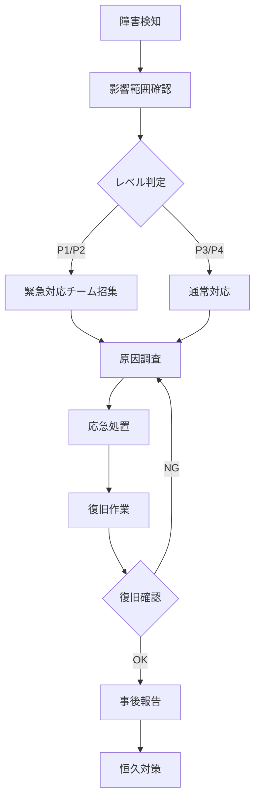

# 運用設計書

## 📌 概要
監視・バックアップ・障害対応手順を定義するドキュメントです。

## 🔍 監視設計

### 監視対象

#### アプリケーション監視

| 監視項目 | 監視方法 | 閾値 | アラート |
|---------|---------|------|---------|
| アプリケーション稼働状態 | ヘルスチェックエンドポイント | - | 3回連続失敗 |
| CPU使用率 | CloudWatch Metrics | 80% | SNS通知 |
| メモリ使用率 | CloudWatch Metrics | 85% | SNS通知 |
| ディスク使用率 | CloudWatch Metrics | 90% | SNS通知 |
| エラーログ | CloudWatch Logs | ERROR level | SNS通知 |
| レスポンスタイム | CloudWatch Metrics | 2秒以上 | SNS通知 |

#### インフラ監視

| 監視項目 | 監視方法 | 閾値 | アラート |
|---------|---------|------|---------|
| ALB ヘルスチェック | AWS Console | Unhealthy | SNS通知 |
| ECS タスク状態 | CloudWatch Events | Task Stopped | SNS通知 |
| RDS 接続数 | CloudWatch Metrics | 180/200 | SNS通知 |
| RDS ストレージ | CloudWatch Metrics | 90% | SNS通知 |
| Redis メモリ | CloudWatch Metrics | 80% | SNS通知 |

#### ビジネスメトリクス

| 監視項目 | 監視方法 | 閾値 | アラート |
|---------|---------|------|---------|
| ユーザー登録数 | アプリケーションログ | - | 日次レポート |
| ログイン成功率 | アプリケーションログ | < 95% | SNS通知 |
| API エラー率 | CloudWatch Metrics | > 5% | SNS通知 |
| 決済成功率 | アプリケーションログ | < 99% | SNS通知 |

### 監視ツール

#### CloudWatch Dashboards

```json
{
  "widgets": [
    {
      "type": "metric",
      "properties": {
        "metrics": [
          ["AWS/ECS", "CPUUtilization", {"stat": "Average"}],
          [".", "MemoryUtilization", {"stat": "Average"}]
        ],
        "period": 300,
        "stat": "Average",
        "region": "ap-northeast-1",
        "title": "ECS Metrics"
      }
    }
  ]
}
```

#### CloudWatch Alarms

```bash
# CPU使用率アラーム
aws cloudwatch put-metric-alarm \
  --alarm-name ecs-cpu-high \
  --alarm-description "ECS CPU utilization is high" \
  --metric-name CPUUtilization \
  --namespace AWS/ECS \
  --statistic Average \
  --period 300 \
  --threshold 80 \
  --comparison-operator GreaterThanThreshold \
  --evaluation-periods 2 \
  --alarm-actions arn:aws:sns:ap-northeast-1:xxx:alerts
```

#### ログ監視

```sql
-- CloudWatch Logs Insights クエリ例

-- エラーログの抽出
fields @timestamp, @message
| filter @message like /ERROR/
| sort @timestamp desc
| limit 100

-- APIエラー率の計算
stats count(*) as total, 
      count(status >= 400) as errors,
      (count(status >= 400) / count(*)) * 100 as error_rate
by bin(5m)
```

## 💾 バックアップ設計

### バックアップ対象

| 対象 | 方式 | 頻度 | 保持期間 | 保存先 |
|------|------|------|---------|--------|
| RDS データベース | 自動スナップショット | 毎日 | 7日間 | AWS Backup |
| RDS データベース | 手動スナップショット | リリース前 | 30日間 | AWS Backup |
| アップロードファイル | S3 レプリケーション | リアルタイム | 永続 | S3 別リージョン |
| アプリケーションコード | Git | コミット時 | 永続 | GitHub |
| 設定ファイル | Git | コミット時 | 永続 | GitHub |
| ログファイル | S3 アーカイブ | 毎日 | 90日間 | S3 Glacier |

### バックアップ手順

#### RDS 手動バックアップ

```bash
# スナップショット作成
aws rds create-db-snapshot \
  --db-instance-identifier prod-db \
  --db-snapshot-identifier prod-db-snapshot-$(date +%Y%m%d-%H%M%S)

# スナップショット一覧
aws rds describe-db-snapshots \
  --db-instance-identifier prod-db

# 古いスナップショットの削除（30日以上前）
aws rds delete-db-snapshot \
  --db-snapshot-identifier <snapshot-id>
```

#### アプリケーションデータのエクスポート

```bash
# データベースダンプ
pg_dump -h <db-host> -U <username> -d <database> > backup_$(date +%Y%m%d).sql

# S3にアップロード
aws s3 cp backup_$(date +%Y%m%d).sql s3://app-backup-prod/db/

# 暗号化してバックアップ
pg_dump -h <db-host> -U <username> -d <database> | \
  gpg --encrypt --recipient admin@example.com > \
  backup_$(date +%Y%m%d).sql.gpg
```

### リストア手順

#### RDS リストア

```bash
# スナップショットからリストア（新規インスタンス作成）
aws rds restore-db-instance-from-db-snapshot \
  --db-instance-identifier restored-db \
  --db-snapshot-identifier prod-db-snapshot-20251109

# ポイントインタイムリカバリ
aws rds restore-db-instance-to-point-in-time \
  --source-db-instance-identifier prod-db \
  --target-db-instance-identifier restored-db \
  --restore-time 2025-11-09T12:00:00Z
```

#### データベースダンプからリストア

```bash
# SQLファイルからリストア
psql -h <db-host> -U <username> -d <database> < backup_20251109.sql

# 暗号化ファイルからリストア
gpg --decrypt backup_20251109.sql.gpg | \
  psql -h <db-host> -U <username> -d <database>
```

## 🚨 障害対応

### 障害レベル定義

| レベル | 定義 | 対応時間 | エスカレーション |
|--------|------|---------|----------------|
| P1 (Critical) | システム全体停止 | 即時 | 30分以内 |
| P2 (High) | 主要機能停止 | 1時間以内 | 2時間以内 |
| P3 (Medium) | 一部機能制限 | 4時間以内 | 8時間以内 |
| P4 (Low) | 軽微な問題 | 1営業日以内 | - |

### 障害対応フロー



### 障害対応手順書

#### アプリケーションが応答しない

**症状**:
- ヘルスチェックが失敗
- ユーザーから「サイトにアクセスできない」との報告

**確認手順**:
1. CloudWatch でアラートを確認
2. ECS タスク状態を確認
3. アプリケーションログを確認
4. ALB のターゲットヘルスを確認

**対応手順**:
```bash
# 1. タスク状態確認
aws ecs describe-tasks \
  --cluster app-cluster \
  --tasks <task-arn>

# 2. ログ確認
aws logs tail /ecs/app --follow

# 3. タスク再起動
aws ecs update-service \
  --cluster app-cluster \
  --service app-service \
  --force-new-deployment

# 4. ヘルスチェック確認
curl -I https://example.com/health
```

---

#### データベース接続エラー

**症状**:
- アプリケーションログに「ECONNREFUSED」エラー
- API が 500 エラーを返す

**確認手順**:
1. RDS インスタンス状態を確認
2. セキュリティグループを確認
3. 接続数を確認

**対応手順**:
```bash
# 1. RDS状態確認
aws rds describe-db-instances \
  --db-instance-identifier prod-db

# 2. 接続数確認
psql -h <db-host> -U <username> -d postgres -c \
  "SELECT count(*) FROM pg_stat_activity;"

# 3. 接続プールサイズの調整（アプリケーション側）
# DATABASE_MAX_CONNECTIONS を増やす

# 4. 長時間実行中のクエリを確認・停止
psql -h <db-host> -U <username> -d <database> -c \
  "SELECT pid, query, query_start FROM pg_stat_activity WHERE state = 'active';"

# 問題のあるクエリを停止
psql -h <db-host> -U <username> -d <database> -c \
  "SELECT pg_terminate_backend(<pid>);"
```

---

#### ディスク容量不足

**症状**:
- CloudWatch アラーム: ディスク使用率 > 90%
- アプリケーションが書き込みエラー

**対応手順**:
```bash
# 1. ディスク使用状況確認
df -h

# 2. 大きなファイルを検索
du -h / | sort -rh | head -20

# 3. ログファイルのクリーンアップ
find /var/log -name "*.log" -mtime +7 -delete

# 4. Docker イメージのクリーンアップ
docker system prune -a --force

# 5. 緊急時: RDS ストレージ拡張
aws rds modify-db-instance \
  --db-instance-identifier prod-db \
  --allocated-storage 200 \
  --apply-immediately
```

## 🔄 定期メンテナンス

### 日次作業

| 作業 | 内容 | 担当 | 実施時間 |
|------|------|------|---------|
| バックアップ確認 | 自動バックアップの成功確認 | 運用担当 | 9:00 |
| ログ確認 | エラーログのレビュー | 運用担当 | 9:30 |
| メトリクス確認 | 前日のメトリクス分析 | 運用担当 | 10:00 |

### 週次作業

| 作業 | 内容 | 担当 | 実施曜日 |
|------|------|------|---------|
| セキュリティパッチ確認 | 依存関係の脆弱性チェック | 開発担当 | 月曜 |
| ディスク使用量確認 | 全サーバーのディスク容量確認 | 運用担当 | 火曜 |
| パフォーマンスレビュー | 週次パフォーマンスレポート作成 | 運用担当 | 金曜 |

### 月次作業

| 作業 | 内容 | 担当 | 実施日 |
|------|------|------|--------|
| 古いバックアップ削除 | 30日以上前のスナップショット削除 | 運用担当 | 毎月1日 |
| ログアーカイブ | 古いログのS3 Glacier移行 | 運用担当 | 毎月1日 |
| セキュリティレビュー | アクセスログのセキュリティ分析 | セキュリティ担当 | 毎月15日 |
| コスト最適化レビュー | AWS コスト分析と最適化 | インフラ担当 | 毎月末 |

### 四半期作業

| 作業 | 内容 | 担当 |
|------|------|------|
| DR訓練 | 災害復旧手順の訓練 | 全員 |
| セキュリティ監査 | 外部監査の実施 | セキュリティ担当 |
| キャパシティプランニング | リソース使用量予測と計画 | インフラ担当 |

## 📊 レポーティング

### 日次レポート

**内容**:
- システム稼働率
- エラー発生件数
- API レスポンスタイム
- アクティブユーザー数

**配信先**: 運用チーム

### 週次レポート

**内容**:
- システムパフォーマンストレンド
- 発生した障害と対応
- バックアップ状況
- セキュリティアラート

**配信先**: 開発チーム、プロジェクトマネージャー

### 月次レポート

**内容**:
- SLA達成状況
- コスト分析
- キャパシティ使用状況
- 改善提案

**配信先**: 経営層、ステークホルダー

## 📝 備考

### 連絡先

| 役割 | 担当者 | 連絡先 | 対応時間 |
|------|--------|--------|---------|
| 運用責任者 | 山田太郎 | xxx@example.com | 24/7 |
| インフラ担当 | 佐藤花子 | xxx@example.com | 平日9-18時 |
| 開発リーダー | 鈴木一郎 | xxx@example.com | 平日9-18時 |
| オンコール | ローテーション | oncall@example.com | 24/7 |

### エスカレーションパス

```
P1障害発生
↓
オンコール担当者（即時）
↓ (30分以内に解決しない場合)
運用責任者
↓ (1時間以内に解決しない場合)
開発リーダー + インフラ担当
↓ (2時間以内に解決しない場合)
CTO
```

